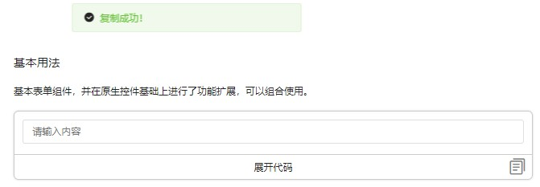
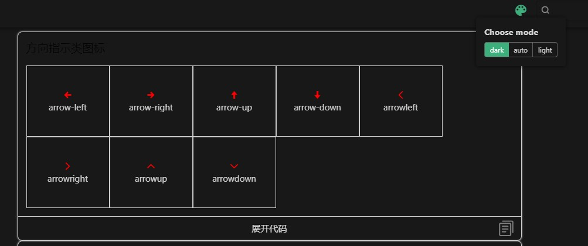
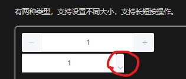

## 小组成员李旭华——项目参与记录

---

##### 2023/02/07
##### 熟悉整个github提交code的流程

1.将公共项目fork到自己的仓库内，git clone到本地，并修改+提交到远程仓库，最后发起pull request给小组仓库，等待组长的merge。

##### 2023/02/11
##### 完成icon的丰富：包括组件完善和添加接口
1.添加了两个Props：图标是否持续旋转和图标旋转角度，并持续旋转属性作用于loading和sun-fill  
2.扩展补充icon组件  
3.封装一个文档页展示的按钮套件  

##### 2023/02/14
##### 完成input的丰富：包括组件完善和添加接口
1、添加多一个输入框状态：错误状态  
2、添加输入框尺寸  
3、添加文字居中  
4、添加前缀和后缀  
5、添加多一种限制最大字数状态：补充超出标红但不限制输入字数  

##### 2023/02/16
##### 完成input-number的丰富：包括组件完善和添加接口
1、添加另一种input-number的模式：右侧加减按钮
1、禁用模式下-按钮的样式变成禁用状态
3、支持鼠标长或短按操作，进行长短按操作的隔离，防止长短按污染
4、支持不同的尺寸

##### 2023/02/22
##### 文档站的用户使用功能优化
1、实现交互组件复制按钮，其中的小问题是：（居中+靠右）两栏的实现以及事件冒泡  
2、实现暗黑和白天主题切换，使用vuepress-theme-reco  
3、按钮input-number中的长按bug+默认icon样式随主题影响修复

问题：icon没有设置默认color，那么就会默认字体color，从而当主题字体color变化，则其会发生变化，但暗黑主题下，则变成偏白色与按钮背景相近，看不清。
采取的方法1：将icon设置color默认为black，发现禁用模式的颜色变浅不生效了（添加!important也不生效）
原因： 禁用模式改变的是xxx-icon样式中的颜色，而icon中的默认color是子组件的内联样式，父组件无法在外部改变子组件样式

采取的方法2：考虑到样式同优先级修改：所以采用在xxx-icon中默认样式 color设置为black，即可解决问题，但要注意：同级谁后谁生效，所以要将禁用模式的样式放在其后，解决。

