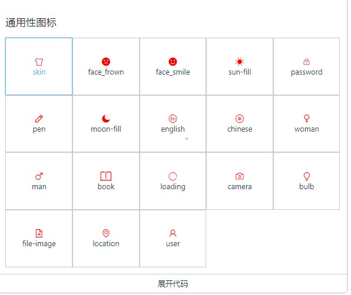

## 小组成员李旭华——项目参与记录

---

##### 2023/02/07
##### 熟悉整个github提交code的流程

1.将公共项目fork到自己的仓库内，git clone到本地，并修改+提交到远程仓库，最后发起pull request给小组仓库，等待组长的merge。

##### 2023/02/11
##### 完成icon的丰富：包括组件完善和添加接口
1.添加了两个Props：图标是否持续旋转和图标旋转角度，并持续旋转属性作用于loading和sun-fill  
2.扩展补充icon组件  
3.封装一个文档页展示的按钮套件  

##### 2023/02/14
##### 完成input的丰富：包括组件完善和添加接口
1、添加多一个输入框状态：错误状态  
2、添加输入框尺寸  
3、添加文字居中  
4、添加前缀和后缀  
5、添加多一种限制最大字数状态：补充超出标红但不限制输入字数  

##### 2023/02/16
##### 完成input-number的丰富：包括组件完善和添加接口
1、添加另一种input-number的模式：右侧加减按钮
1、禁用模式下-按钮的样式变成禁用状态
3、支持鼠标长或短按操作，进行长短按操作的隔离，防止长短按污染
4、支持不同的尺寸